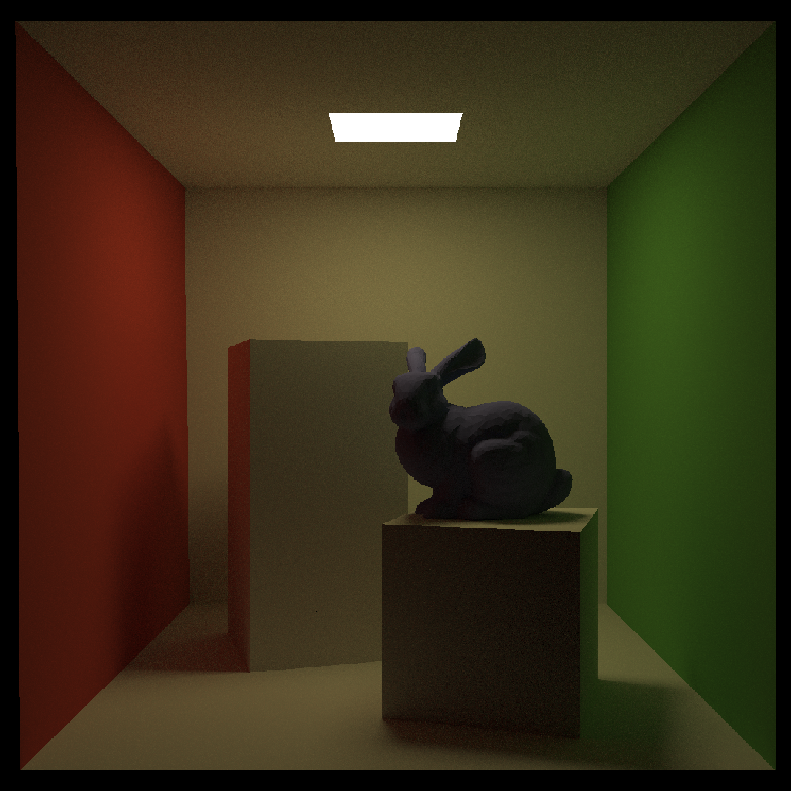

# 物理光线追踪渲染引擎

一个从零构建的、高性能的蒙特卡洛路径追踪（Monte Carlo Path Tracing）渲染管线。使用 C++17 实现，不依赖任何图形 API，完全自主实现核心数据结构与算法。

## 核心特性

### 🎯 渲染方法
- **蒙特卡洛路径追踪（Monte Carlo Path Tracing）**：基于物理的光照积分，支持全局光照与复杂光源交互
- **递归光线跟踪**：自定义递归深度，完整的光线-场景交互模拟

### 📊 采样优化
- **Sobol 低差异序列（Quasi-Monte Carlo, QMC）**：替代伪随机数，采用确定性低差异点集，加速收敛、减少噪声
- **维度哈希**：像素级种子生成，保证不同像素的采样独立性

### ⚡ 加速结构
- **BVH 树（包围体层次树）**：支持 $O(\log n)$光线求交加速
- **表面积启发式（Surface Area Heuristic, SAH）**：动态调整树构建策略（参数 B=12），最小化期望遍历成本
- **包围盒优化**：AABB 快速求交与轴对齐分割，支持自适应归一化

### 🧵 并行渲染
- **多线程分块渲染**：使用 C++ Threads 标准库实现 Work Stealing
- **Tile-based 分割**：32×32 像素分块独立处理，提高 CPU 缓存命中率与任务平衡
- **原子操作进度追踪**：实时显示渲染进度，支持动态工作分配

### 🎨 材质系统
- **BSDF 接口框架**：`sample()`、`pdf()`、`eval()` 三要素完整设计
- **漫反射材质**：Lambertian BRDF，余弦加权半球采样
- **自发光材质**：面光源支持，直接光照与环境光贡献
- **可扩展架构**：支持镜面反射、Microfacet、各向异性等材质扩展

### 📝 线性代数类
- **Vec3f / Vec4f**：向量类，支持点积、叉积、归一化等基础操作
- **Mat4f**：4×4 矩阵，支持矩阵乘法、转置、求逆（高斯-约当消元）

## 渲染结果


## 项目结构

```
render/
├── CMakeLists.txt                 # CMake 构建配置
├── README.md                      # 本文件
│
├── include/stat_render/           # 头文件
│   ├── core/
│   │   ├── common.h               # 全局常量与宏定义
│   │   ├── Vector.h               # Vec3f, Vec4f, Point3f 类定义
│   │   ├── Matrix.h               # Mat4f 矩阵类
│   │   ├── Ray.h                  # 射线与光线跟踪结构
│   │   ├── Camera.h               # 相机模型
│   │   ├── Film.h                 # 帧缓冲（图像存储与输出）
│   │   ├── Hit.h                  # 光线求交结果结构
│   │   └── transform.h            # 坐标变换（相机到世界）
│   │
│   ├── shapes/
│   │   ├── Object.h               # 几何体基类
│   │   ├── Sphere.h               # 球体
│   │   ├── Triangle.h             # 三角形（带纹理坐标）
│   │   └── Mesh.h                 # 三角形网格
│   │
│   ├── accelerators/
│   │   ├── Bound.h                # 轴对齐包围盒（AABB）
│   │   └── BVH.h                  # BVH 树结构（SAH 优化）
│   │
│   ├── materials/
│   │   ├── Material.h             # BSDF 基类接口
│   │   ├── Diffuse.h              # Lambertian 漫反射
│   │   └── Emissive.h             # 自发光材质
│   │
│   ├── samplers/
│   │   ├── sampler.h              # 采样器基类
│   │   ├── QMC.h                  # Sobol 采样器实现
│   │   └── sobolMatrix.h          # Sobol 方向数表
│   │
│   ├── lights/
│   │   ├── Light.h                # 光源基类
│   │   ├── PointLight.h           # 点光源
│   │   └── AreaLights.h           # 面光源
│   │
│   ├── scenes/
│   │   ├── Scene.h                # 场景管理
│   │   └── parser.h               # OBJ 文件解析器
│   │
│   ├── renderers/
│   │   └── Renderer.h             # 渲染管线（单线程/多线程）
│   │
│   └── textures/
│       └── Texture.h              # 纹理系统（预留接口）
│
├── src/                           # 源实现文件
│   ├── main.cpp                   # 程序入口，场景配置示例
│   ├── renderers/Renderer.cpp     # 路径追踪积分器实现
│   ├── scenes/
│   │   ├── Scene.cpp              # 场景加载与 BVH 构建
│   │   └── parser.cpp             # OBJ 解析（顶点、面、法线）
│   ├── shapes/
│   │   ├── Sphere.cpp             # 球体光线求交
│   │   ├── Triangle.cpp           # 三角形 Möller-Trumbore 算法
│   │   └── Mesh.cpp               # 网格数据管理
│   ├── accelerators/
│   │   ├── Bound.cpp              # AABB 求交与归一化
│   │   └── BVH.cpp                # BVH 树构建（SAH 递推）与遍历
│   ├── materials/
│   │   ├── Diffuse.cpp            # 漫反射采样与 BRDF 计算
│   │   └── Emissive.cpp           # 自发光评估
│   ├── samplers/
│   │   └── sampler.cpp            # Sobol 序列生成
│   ├── core/
│   │   ├── Film.cpp               # 帧缓冲写入与 PPM 导出
│   │   └── transform.cpp          # 矩阵变换实现
│   └── ...
│
├── asset/                         # 模型资源
│   ├── bunny/                     # Stanford Bunny （低多边形）
│   ├── cornellbox/                # Cornell Box 场景
│   └── ...
│
├── images/                        # 渲染输出结果
│   ├── test_*.ppm                 # 各测试场景输出
│   └── ...
│
├── docs/                          # 算法文档
│   ├── 1-RayHitTest.md            # 光线求交详解（三角形、球体、AABB）
│   ├── 2-SampleUnitHemisphere.md  # 余弦加权半球采样推导
│   ├── 3-SAH.md                   # BVH SAH 优化策略与实现
│   └── 4-RayHitBoundingBox.md     # 包围盒求交算法
│
└── test/                          # 单元测试（预留）
```

## 快速开始

### 依赖项

- **C++17** 或更高版本
- **CMake 3.10** 或更高版本

### 构建

```bash
# 1. 进入项目目录
cd render

# 2. 创建构建目录
mkdir -p build
cd build

# 3. 配置与构建
cmake ..
make -j$(nproc)

# 或使用 CMake 直接构建
cmake --build . --parallel
```

### 运行

```bash
./main
```

程序将执行 `main.cpp` 中定义的场景，输出渲染结果为 PPM 格式图像文件。

## 核心算法

### 1. Monte-Carlo 路径追踪

渲染方程的数值求解：

$$

L_o(p, \omega_o) = L_e(p, \omega_o) + \int_{\Omega} f_r(p, \omega_i, \omega_o) L_i(p, \omega_i) (\omega_i \cdot n) d\omega_i

$$

递归展开与蒙特卡洛估计：

```
Color CastRay(Ray, depth):
    if depth > max_depth: return 0
    
    hit = Scene.Intersect(ray)
    if no hit: return background
    
    // 直接光照
    direct = SampleLight() * BSDF
    
    // 间接光照（递归）
    wi = Material.Sample()
    indirect = CastRay(new_ray, depth+1) * BSDF / pdf
    
    return direct + indirect
```


### 2. Sobol 低差异序列

相比伪随机数的优势：

| 特性 | 伪随机 | Sobol 序列 |
|------|--------|-----------|
| 分布 | 聚集 | 均匀覆盖 |
| 收敛速率 | O(1/√N) | O(log N / N) |
| 蓝噪声 | ✗ | ✓ |
| 周期性 | 周期长 | 确定性 |

实现：

```cpp
class SobolSampler {
    uint64_t sampleIndex;
    uint32_t pixelSeed;
    
    uint32_t HashPixel2D(int x, int y);  // 像素级种子
    float Next1D();                       // 获取下一维样本
};
```

### 3. SAH 优化 BVH

**构建策略**：

1. **分割**：按 SAH 成本函数选择最优分割面
   $$
   C = C_t + C_{left} \cdot \frac{A_{left}}{A_{parent}} \cdot N_{left} + C_{right} \cdot \frac{A_{right}}{A_{parent}} \cdot N_{right}
   $$
   
2. **启发式参数**：`B = 12` 候选分割位置

3. **递归终止**：当 `N < B` 时停止分割，转为叶子节点

**遍历**：$O(\log n)$ 射线-场景求交

```cpp
Hit BVH::intersect(const Ray& ray) {
    return TraverseNode(head, ray);  // 递归遍历
}
```

### 4. 多线程渲染架构

**Work Stealing 调度**：

```
Master Thread:
  ├─ 生成 Tile 列表
  └─ 监控全局进度
  
Worker Threads (N-10):
  ├─ 从队列获取 Tile
  ├─ 并行渲染像素
  ├─ 原子操作更新进度
  └─ 工作窃取（无阻塞）
```

## 扩展与改进方向

### 已规划
- [ ] 镜面反射与折射（BTDF）
- [ ] 粗糙导体与微表面 BRDF（GGX/Beckmann）
- [ ] 环境光映射（IBL）与重要性采样
- [ ] 体积渲染（焦散、烟雾）
- [ ] SIMD 向量化加速
- [ ] GPU 计算加速（CUDA/HIP）

### 可选优化
- 景深（Depth of Field）与运动模糊
- 纹理映射与法线贴图
- 次表面散射（SSS）
- 点光源直接光照重要性采样
- 时间相干性优化（temporal coherence）

## 文档与参考

- **Physically Based Rendering (3rd Ed.)**  
- **Ray Tracing in One Weekend**
- **Fundamentals of Computer Graphics, Fourth Edition**
- **Games101**

## 许可证

MIT License - 详见 [LICENSE](LICENSE) 文件

---

**项目创始**：2025.12  
**最后更新**：2026.04
**维护者**：Mergic  

